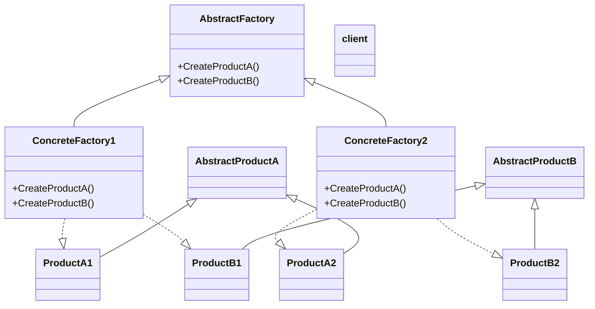

# [Abstract Factory](https://refactoring.guru/design-patterns/abstract-factory) 

**Abstract Factory** is a creational design pattern that lets you produce families of related objects without specifying their concrete classes.

## Problem

Imagine that you’re creating a furniture shop simulator. Your code consists of classes that represent:

1. A family of related products, say: Chair + Sofa + CoffeeTable.

2. Several variants of this family. For example, products Chair + Sofa + CoffeeTable are available in these variants: Modern, Victorian, ArtDeco.

You need a way to create individual furniture objects so that they match other objects of the same family. Customers get quite mad when they receive non-matching furniture.

Also, you don’t want to change existing code when adding new products or families of products to the program. Furniture vendors update their catalogs very often, and you wouldn’t want to change the core code each time it happens.

## Solution

The first thing the Abstract Factory pattern suggests is to explicitly declare interfaces for each distinct product of the product family (e.g., chair, sofa or coffee table). Then you can make all variants of products follow those interfaces. For example, all chair variants can implement the Chair interface; all coffee table variants can implement the CoffeeTable interface, and so on.

**composition** (by containing instances of other classes that implement the desired functionality)

